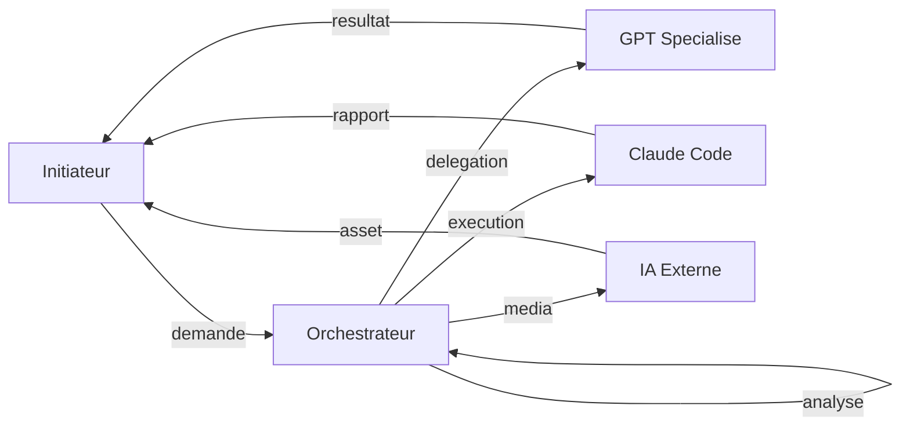

# AI Orchestrated GPT Production System

Un systeme de production structure pour orchestrer plusieurs GPT personnalises via un Orchestrateur central unique, opere par copier-coller avec Claude Code et Spec-Kit.

## Pourquoi ce systeme ?

- **Un seul point d'entree** : L'Orchestrateur (Esteban Durand) analyse et redirige toutes vos demandes
- **15 GPT specialises** : Product, Tech, Design, Quality, Data — chacun expert dans son domaine
- **Zero confusion** : Vous ne choisissez jamais a qui parler, le systeme decide
- **Copier-coller strict** : Aucun automatisme cache, tout est explicite et tracable

## Workflow Principal



## Quick Start

**1. Prerequis**
- ChatGPT Plus (GPT Builder)
- Claude Code avec Spec-Kit

**2. Deployer les GPT**
```bash
# Copier chaque fichier prompts/*.md dans le GPT Builder de ChatGPT
```

**3. Demarrer un projet**
```
[Dans l'Orchestrateur]
Je veux creer une application de gestion de taches
```

## Prerequis Techniques

| Outil | Requis | Usage |
|-------|--------|-------|
| ChatGPT Plus | Obligatoire | GPT Builder pour les 15 GPT |
| Claude Code | Obligatoire | Execution des commandes Spec-Kit |
| Spec-Kit | Obligatoire | Structuration des projets |

## Documentation

- [Documentation complete](./docs/README.md)
- [Vue d'ensemble](./docs/00-overview.md)
- [Installation](./docs/02-installation.md)
- [Architecture](./docs/01-architecture.md)
- [Workflows](./docs/04-workflows.md)

## Structure du Projet

```
prompts/
├── 01-orchestrateur/   # Esteban Durand
├── 02-product/         # Benjamin Caron
├── 03-tech/            # Quentin, Thomas, Ulysse, Yassine
├── 04-quality/         # Adrien, Rachid, Sarah
├── 05-design/          # Clara, Lucas, Maya, Nassim, Elodie
└── 06-data/            # Romain Girard

docs/                   # Documentation complete
```

## Licence

MIT
