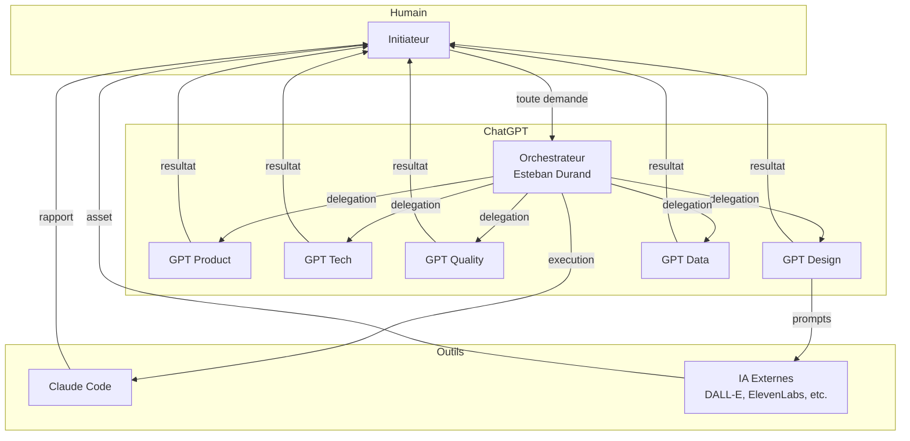
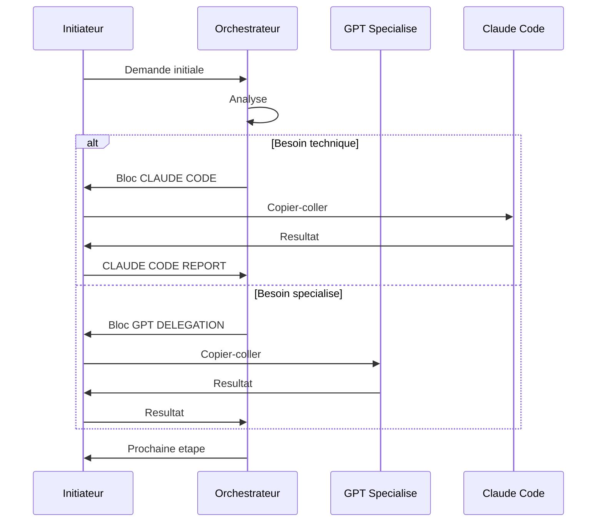

# Architecture

[← Vue d'ensemble](./00-overview.md) | [Index](./README.md) | [Installation →](./02-installation.md)

---

## Vue d'Ensemble

Le systeme est compose de 4 types d'acteurs qui interagissent via un workflow strict base sur le copier-coller.



## L'Orchestrateur : Esteban Durand

### Role

L'Orchestrateur est le **seul point d'entree** du systeme. Il :
- Recoit TOUTES les demandes de l'Initiateur
- Analyse et decide de la suite logique
- Redirige vers le bon GPT specialise ou Claude Code
- Ne produit JAMAIS de contenu directement

### Responsabilites

1. Generer des blocs prets a copier-coller
2. Rediriger vers GPT specialises, Claude Code ou IA externes
3. Analyser les retours Claude Code
4. Demander des tests manuels si necessaire
5. Generer des snapshots projet

### Regles Non Negociables

- N'implemente JAMAIS directement
- Ne prend AUCUNE decision implicite
- Utilise UNIQUEMENT les formats standardises
- Redirige vers le bon GPT selon le domaine
- Analyse TOUTE demande avant de repondre

## Les 15 GPT Specialises

### Tableau Complet

| # | Nom | Role | Domaine | Perimetre |
|---|-----|------|---------|-----------|
| 1 | Esteban Durand | Orchestrateur | Central | Analyse, decision, redirection |
| 2 | Benjamin Caron | Product Lead | Product | Vision produit, roadmap, priorisation |
| 3 | Quentin Delacroix | Tech Lead | Tech | Architecture, choix techniques |
| 4 | Thomas Laurent | Frontend Lead | Tech | UI, composants, React/Vue |
| 5 | Ulysse Fabre | Backend Lead | Tech | API, services, bases de donnees |
| 6 | Yassine El Amrani | DevOps/SRE | Tech | CI/CD, infrastructure, deploiement |
| 7 | Adrien Roche | QA/Test Lead | Quality | Tests, validation, qualite |
| 8 | Rachid Benyahia | Security/AppSec | Quality | Securite, vulnerabilites, audits |
| 9 | Sarah Klein | Legal/RGPD | Quality | Conformite, RGPD, mentions legales |
| 10 | Clara Morel | UX/UI Designer | Design | Wireframes, maquettes, UX |
| 11 | Lucas Perrin | Visual Designer | Design | Logos, branding, identite visuelle |
| 12 | Maya Renaud | Motion/Video | Design | Animations, videos, motion |
| 13 | Nassim Haddad | Audio/Voice | Design | Voix, musique, sound design |
| 14 | Elodie Martin | 3D/Asset | Design | Modeles 3D, assets |
| 15 | Romain Girard | Data Analyst | Data | Metriques, KPIs, analyses |

### Principe d'Isolation

Chaque GPT :
- Possede un nom, prenom et role fixes
- A un perimetre strictement defini
- Refuse TOUTE tache hors perimetre
- Renvoie vers l'Orchestrateur si necessaire

## Regles de Communication

### Regle 1 : Point d'Entree Unique

```
❌ Initiateur → GPT Specialise (direct)
✅ Initiateur → Orchestrateur → GPT Specialise
```

L'Initiateur ne contacte JAMAIS un GPT specialise directement.

### Regle 2 : Pas de GPT-to-GPT

```
❌ GPT A → GPT B
✅ GPT A → Initiateur → Orchestrateur → GPT B
```

Aucun GPT ne contacte un autre GPT. Tout passe par l'Initiateur.

### Regle 3 : Copier-Coller Strict

```
❌ Automation API
✅ L'Initiateur copie-colle manuellement chaque bloc
```

Aucun automatisme cache. Tout est explicite et tracable.

## Formats de Blocs Standardises

### 1. Delegation vers Claude Code

```
=== CLAUDE CODE ===
[commande Spec-Kit + contenu]
=== END ===
```

### 2. Delegation vers GPT Specialise

```
=== GPT DELEGATION ===
Cible : [Prenom Nom] — [Role]
Message a copier :
[contenu de la demande]
=== END ===
```

### 3. Rapport Claude Code

```
=== CLAUDE CODE REPORT ===
[sortie brute de Claude Code]
=== END ===
```

### 4. Rapport Test Manuel

```
=== MANUAL TEST REPORT ===
Fonctionnel :
Casse :
Notes :
=== END ===
```

### 5. Snapshot Projet

```
=== PROJECT SNAPSHOT vX ===
Resume : [2-3 phrases]
Etat : [phase actuelle]
Decisions : [liste]
Prochaines etapes : [liste]
Fichiers cles : [chemins]
=== END ===
```

## Flux de Travail Type



---

[← Vue d'ensemble](./00-overview.md) | [Index](./README.md) | [Installation →](./02-installation.md)
