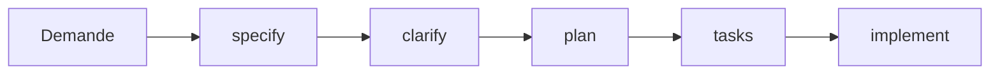

# Workflows

[← Deploiement GPT](./03-deploiement-gpt.md) | [Index](./README.md) | [IA Externes →](./05-media-ia-externe.md)

---

## Introduction

Les workflows definissent les sequences d'actions pour accomplir des objectifs specifiques. Chaque workflow produit des blocs prets a copier-coller.

## Workflow 1 : Nouveau Projet

### Objectif

Demarrer un nouveau projet de zero avec Spec-Kit.

### Etapes



### Execution

**Etape 1 : Exprimer le besoin**

```
[A l'Orchestrateur]
Je veux creer une application de gestion de taches avec authentification
```

**Etape 2 : Recevoir la specification**

L'Orchestrateur retourne :

```
=== CLAUDE CODE ===
/speckit.specify

# Feature: Application de gestion de taches

## Contexte
[description detaillee]

## Objectif
[objectifs]

## Portee
[inclus / exclus]
=== END ===
```

**Etape 3 : Executer dans Claude Code**

Copier le bloc dans Claude Code. Resultat : fichier `specs/XXX-feature/spec.md` cree.

**Etape 4 : Clarifier**

```
[A l'Orchestrateur]
=== CLAUDE CODE REPORT ===
Specification creee dans specs/001-task-manager/spec.md
=== END ===
```

L'Orchestrateur repond avec `/speckit.clarify` si necessaire.

**Etape 5 : Planifier, decouper, implementer**

Continuer avec `/speckit.plan`, `/speckit.tasks`, `/speckit.implement`.

---

## Workflow 2 : Nouvelle Feature

### Objectif

Ajouter une fonctionnalite a un projet existant.

### Etapes

1. Demander a l'Orchestrateur
2. Recevoir un bloc `/speckit.specify` avec le contexte
3. Executer dans Claude Code (nouvelle branche creee)
4. Suivre le workflow standard (clarify → plan → tasks → implement)

### Exemple

```
[A l'Orchestrateur]
Je veux ajouter des notifications push a mon application
```

```
=== CLAUDE CODE ===
/speckit.specify

# Feature: Notifications Push

## Contexte
Application existante de gestion de taches.
Besoin d'alerter les utilisateurs sur les deadlines.
...
=== END ===
```

---

## Workflow 3 : Correction de Bug

### Objectif

Corriger un bug identifie de maniere structuree.

### Etapes

1. **Reporter** : Decrire le bug a l'Orchestrateur
2. **Analyser** : Recevoir une delegation vers le GPT technique approprie
3. **Diagnostiquer** : Le GPT identifie la cause probable
4. **Corriger** : Recevoir les instructions de correction via Claude Code
5. **Valider** : Tester et confirmer

### Exemple

```
[A l'Orchestrateur]
Bug : le bouton de connexion ne repond pas sur Safari mobile
```

L'Orchestrateur redirige vers Thomas Laurent (Frontend Lead) :

```
=== GPT DELEGATION ===
Cible : Thomas Laurent — Frontend Lead
Message a copier :
Bug a analyser :
- Symptome : bouton de connexion ne repond pas
- Environnement : Safari mobile
- Comportement attendu : redirection vers dashboard
=== END ===
```

Thomas analyse et retourne des instructions de correction.

---

## Workflow 4 : Review de Code

### Objectif

Obtenir une revue de code structuree.

### Etapes

1. Soumettre le code a l'Orchestrateur
2. Recevoir une delegation vers Quentin (Tech Lead)
3. Obtenir les commentaires et recommandations
4. Appliquer les corrections

### Exemple

```
[A l'Orchestrateur]
Je voudrais une review de mon composant React :
[code]
```

---

## Workflow 5 : Analyse de Securite

### Objectif

Valider la securite d'un composant ou d'une architecture.

### Etapes

1. Soumettre la demande a l'Orchestrateur
2. Recevoir une delegation vers Rachid (Security/AppSec)
3. Obtenir l'analyse de risques
4. Appliquer les recommandations

### Exemple

```
[A l'Orchestrateur]
Je veux valider la securite de mon systeme d'authentification JWT
```

```
=== GPT DELEGATION ===
Cible : Rachid Benyahia — Security/AppSec
Message a copier :
Analyse de securite demandee :
- Sujet : Authentification JWT
- Context : Application web Node.js
- Preoccupations : stockage tokens, expiration, refresh
=== END ===
```

---

## Commandes Spec-Kit

| Commande | Description | Quand l'utiliser |
|----------|-------------|------------------|
| `/speckit.specify` | Definir une feature | Debut de projet/feature |
| `/speckit.clarify` | Clarifier les ambiguites | Apres specify |
| `/speckit.plan` | Generer le plan technique | Apres clarify |
| `/speckit.tasks` | Decouper en taches | Apres plan |
| `/speckit.implement` | Executer les taches | Apres tasks |
| `/speckit.constitution` | Voir/modifier la constitution | Configuration |

---

[← Deploiement GPT](./03-deploiement-gpt.md) | [Index](./README.md) | [IA Externes →](./05-media-ia-externe.md)
