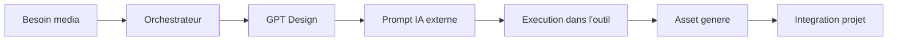

# IA Externes : Generation de Medias

[← Workflows](./04-workflows.md) | [Index](./README.md) | [Snapshots →](./06-snapshots.md)

---

## Introduction

Les GPT Design peuvent generer des prompts optimises pour les IA externes specialisees dans la creation de medias : images, audio, video, 3D.

## Format de Delegation IA Externe

```
=== IA EXTERNE ===
Outil : [Nom de l'outil]
Type : [Type de contenu]

Prompt :
[Prompt optimise pour l'outil]

Instructions post-generation :
[Comment utiliser le resultat]
=== FIN IA EXTERNE ===
```

---

## Generation d'Images

### GPT Responsables

- **Clara Morel** (UX/UI) : Mockups, wireframes, icones
- **Lucas Perrin** (Visual) : Logos, branding, illustrations

### Outils Supportes

| Outil | Usage | Forces |
|-------|-------|--------|
| DALL-E | General, integration ChatGPT | Facilite d'acces |
| Midjourney | Artistique, concepts | Qualite visuelle |
| Adobe Firefly | Commercial, brand-safe | Droits d'usage clairs |

### Exemple : Demande de Logo

```
[A l'Orchestrateur]
J'ai besoin d'un logo minimaliste pour mon app de taches
```

L'Orchestrateur redirige vers Lucas Perrin :

```
=== GPT DELEGATION ===
Cible : Lucas Perrin — Visual Designer / Brand
Message a copier :
Besoin : Logo minimaliste pour application de gestion de taches
Style souhaite : Moderne, epure
Couleurs : A proposer
Format : SVG vectoriel
=== END ===
```

Lucas retourne :

```
=== IA EXTERNE ===
Outil : Midjourney
Type : Logo concept

Prompt :
minimal logo for task management app, checkmark symbol,
modern geometric design, flat design, single color,
professional, clean lines, white background --v 6

Instructions post-generation :
1. Selectionner la meilleure variation
2. Upscale en haute resolution
3. Vectoriser avec Adobe Illustrator ou Figma
=== FIN IA EXTERNE ===
```

---

## Generation Audio

### GPT Responsable

- **Nassim Haddad** (Audio/Voice & Sound)

### Outils Supportes

| Outil | Usage | Forces |
|-------|-------|--------|
| ElevenLabs | Voix-off, narration | Qualite vocale |
| Suno | Musique, jingles | Generation musicale |
| Udio | Ambient, sound design | Variete de styles |

### Exemple : Voix-off

```
[A l'Orchestrateur]
J'ai besoin d'une voix-off pour ma video de presentation
```

Nassim retourne :

```
=== IA EXTERNE ===
Outil : ElevenLabs
Type : Voix-off

Prompt :
Texte a lire :
"Bienvenue sur TaskMaster, l'application qui revolutionne
votre productivite. Gerez vos taches, atteignez vos objectifs."

Parametres :
- Voix : Adam (professionnelle, masculine)
- Stabilite : 0.7
- Clarte : 0.8

Instructions post-generation :
1. Telecharger en MP3 haute qualite
2. Ajuster le volume si necessaire
3. Integrer dans la timeline video
=== FIN IA EXTERNE ===
```

---

## Generation Video

### GPT Responsable

- **Maya Renaud** (Motion/Video)

### Outils Supportes

| Outil | Usage | Forces |
|-------|-------|--------|
| Runway Gen-3 | Video generation | Qualite cinema |
| Pika | Animations courtes | Rapidite |
| Kling AI | Videos longues | Duree etendue |

### Exemple : Teaser

```
[A l'Orchestrateur]
J'ai besoin d'un teaser de 10 secondes pour mon app
```

Maya retourne :

```
=== IA EXTERNE ===
Outil : Runway Gen-3
Type : Video teaser

Prompt :
Smooth camera push-in on a modern smartphone displaying
a task management app, clean interface, checkmarks appearing
one by one, soft ambient lighting, minimal office background

Parametres :
- Duree : 10 secondes
- Style : Cinematique
- Resolution : 1080p

Instructions post-generation :
1. Ajouter la musique de fond
2. Superposer le logo en fin
3. Exporter en MP4 H.264
=== FIN IA EXTERNE ===
```

---

## Generation 3D

### GPT Responsable

- **Elodie Martin** (3D/Asset)

### Outils Supportes

| Outil | Usage | Forces |
|-------|-------|--------|
| Meshy | Text-to-3D | Rapidite |
| Tripo3D | Modeles detailles | Qualite |
| Luma Genie | Scenes completes | Realisme |

### Exemple : Icone 3D

```
[A l'Orchestrateur]
J'ai besoin d'une icone 3D de checkbox pour mon app
```

Elodie retourne :

```
=== IA EXTERNE ===
Outil : Meshy
Type : Modele 3D

Prompt :
3D checkbox icon, rounded corners, glossy material,
green checkmark, white background, stylized,
app icon style, clean geometry

Parametres :
- Format : GLTF
- Textures : Oui
- Poly count : Low-poly

Instructions post-generation :
1. Telecharger le modele GLTF
2. Ajuster les materiaux dans Blender si necessaire
3. Exporter les rendus pour les differentes tailles d'icone
=== FIN IA EXTERNE ===
```

---

## Workflow Complet Media



---

[← Workflows](./04-workflows.md) | [Index](./README.md) | [Snapshots →](./06-snapshots.md)
