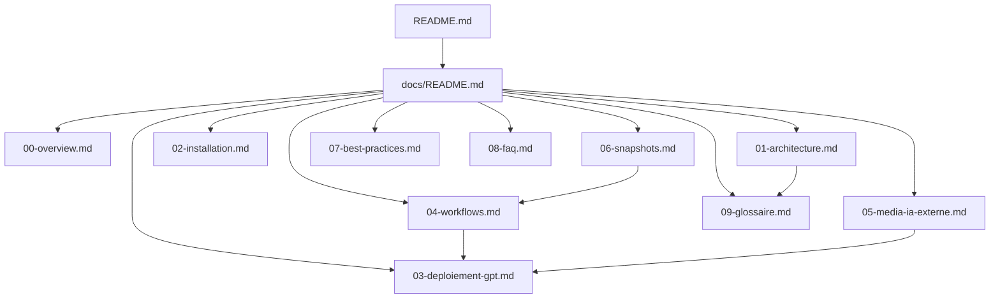

# Data Model: Documentation & Onboarding

**Feature**: 002-docs-and-onboarding
**Date**: 2025-12-26

## Entites Documentaires

Cette feature ne manipule pas de donnees applicatives mais produit des fichiers de documentation. Le "data model" decrit la structure des livrables.

### Entite: README.md

**Localisation**: Racine du repository

**Structure**:
```markdown
# [Titre du Projet]

[Badge(s) optionnel(s)]

## Qu'est-ce que c'est ?
[Pitch 2-3 phrases]

## Pourquoi ?
[Problemes resolus, benefices]

## Quick Start
1. [Etape 1]
2. [Etape 2]
3. [Etape 3]

## Documentation
[Liens vers docs/]

## Prerequis
[Liste des prerequis]
```

**Contraintes**:
- Maximum 500 mots
- Lisible en < 5 minutes
- Liens fonctionnels vers docs/

### Entite: docs/README.md

**Localisation**: `docs/README.md`

**Structure**:
```markdown
# Documentation

## Table des Matieres

1. [00-overview.md](./00-overview.md) — Vue d'ensemble
2. [01-architecture.md](./01-architecture.md) — Architecture
...
```

**Contraintes**:
- Index complet de tous les fichiers
- Liens relatifs fonctionnels

### Entite: Page de Documentation

**Localisation**: `docs/XX-nom.md`

**Structure commune**:
```markdown
# [Titre]

## [Section 1]
[Contenu]

## [Section 2]
[Contenu]

---
[Navigation: Precedent | Suivant]
```

**Contraintes par page**:

| Page | Sections Obligatoires |
|------|----------------------|
| 00-overview | Vision, Problemes resolus, Philosophie |
| 01-architecture | Schema flux, GPT liste, Regles |
| 02-installation | Prerequis, Etapes, Verification |
| 03-deploiement-gpt | GPT Builder, Nommage, Test |
| 04-workflows | Projet, Feature, Bug |
| 05-media-ia-externe | Par type (image, audio, video, 3D) |
| 06-snapshots | Quand, Comment, Modele |
| 07-best-practices | Do, Don't, Anti-patterns |
| 08-faq | 10+ Q&A |
| 09-glossaire | Termes avec definitions |

## Structure des Fichiers

```text
/
├── README.md                 # Entite README
└── docs/
    ├── README.md             # Entite Index
    ├── 00-overview.md        # Entite Page
    ├── 01-architecture.md    # Entite Page
    ├── 02-installation.md    # Entite Page
    ├── 03-deploiement-gpt.md # Entite Page
    ├── 04-workflows.md       # Entite Page
    ├── 05-media-ia-externe.md# Entite Page
    ├── 06-snapshots.md       # Entite Page
    ├── 07-best-practices.md  # Entite Page
    ├── 08-faq.md             # Entite Page
    └── 09-glossaire.md       # Entite Page
```

## Relations entre Entites



## Validation

| Entite | Critere | Methode |
|--------|---------|---------|
| README.md | < 500 mots | `wc -w README.md` |
| Toutes pages | 100% francais | Relecture manuelle |
| Toutes pages | Pas de "Cloud Code" | `grep -r "Cloud Code"` |
| Index | Liens fonctionnels | Click test |
| Pages | Navigation coherente | Parcours sequentiel |
